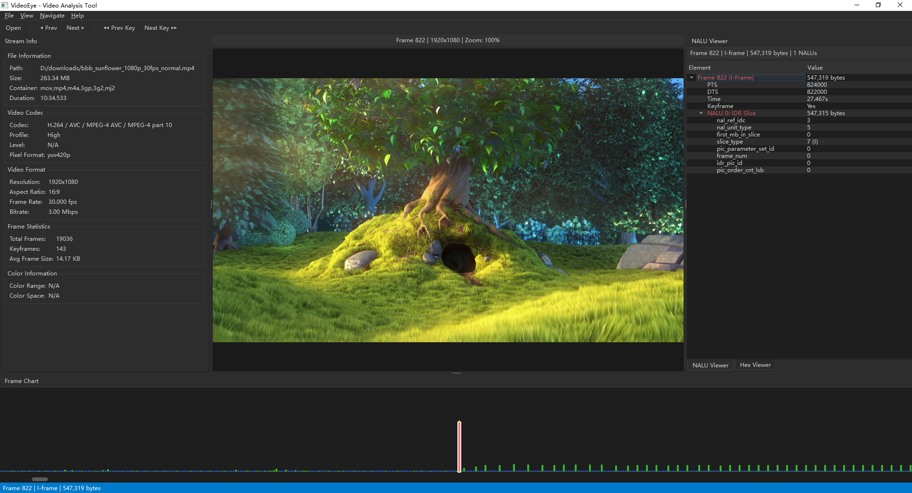

# VideoEye - Video Stream Analysis Tool

[中文版](README.md)

VideoEye is a professional video stream analysis tool built with Python and PyQt6, inspired by Elecard StreamEye. It allows video engineers and codec developers to visualize and analyze H.264/AVC and H.265/HEVC bitstreams intuitively.



## Key Features

- **Multi-Standard Support**: In-depth analysis for H.264/AVC and H.265/HEVC video streams.
- **Rich Visualizations**:
  - **Frame Chart**: Visual distribution of I/P/B frames and their sizes.
  - **NALU Viewer**: Tree-view inspection of NAL Unit headers and syntax.
  - **Hex Viewer**: Raw byte stream inspection synchronized with NALU selection.
- **Decoded Preview**: Built-in decoder to view actual decoded frames.
- **Precise Navigation**: Frame-by-frame stepping, keyframe jumping, with all views fully synchronized.
- **Modern UI**: Dark-themed interface based on PyQt6 with drag-and-drop support.

## Quick Start

### Prerequisites

Ensure you have Python 3.8+ installed.

```bash
pip install -r requirements.txt
```

### Running

```bash
python main.py
# Or open a file directly
python main.py path/to/video.mp4
```

## Shortcuts

- **Left / Right**: Previous / Next Frame
- **Shift + Left / Right**: Previous / Next Keyframe
- **Home / End**: First / Last Frame
- **F**: Fit to Window
- **1**: Zoom 100%
